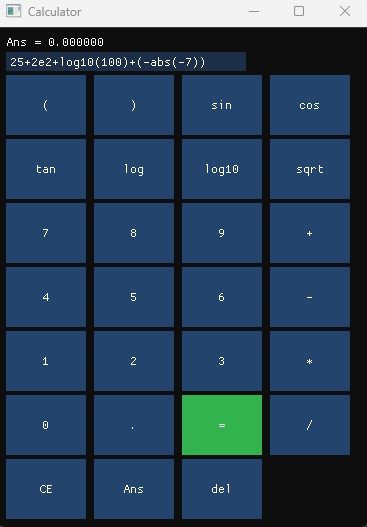

# 🧮 calculator-gui

一個使用現代 C++ 撰寫的 GUI 科學計算機，整合 ImGui + GLFW，並重用 calculator\_core 函式庫，支援滑鼠點擊與鍵盤輸入操作。

本專案是 [calculator-repl](https://github.com/cheung4843/calculator-repl) 的圖形介面延伸版，具備完整運算功能、函式支援、括號與科學記號(科學記號於 GUI 模式中則是手動輸入)解析。

<table>
  <tr>
    <td></td>
    <td></td>
  </tr>
</table>

你可以手動輸入在 CLI 模式下有支援的函式:

```
abs, sqrt, log, log10, exp, sin, cos, tan
```
或是使用 GUI 模式的按鈕點擊輸入，但記得自己要補上右括號。

---

## 🚀 快速開始

### 系統需求

* C++20 編譯器（如 GCC 11+ / MSVC 2022+ / Clang 13+）
* CMake 3.16+
* PowerShell（建議使用 build/run 腳本）
* MinGW (若在 Windows 開發)

---

### 📦 建置流程

1. Clone 專案（包含子模組）：

```bash
git clone --recurse-submodules https://github.com/cheung4843/calculator-gui.git
cd calculator-gui
```

2. 使用建構腳本（建議使用 PowerShell）：

```powershell
./build.ps1
```

3. 執行主程式（可選 CLI 或 GUI）：

```powershell
./run.ps1
```

---

## 💻 功能支援

* 四則運算：`+`, `-`, `*`, `/`
* 括號支援：如 `(1 + 2) * 3`
* 科學記號：如 `1.2e5`, `3E-8`
* 一元負號：如 `-5`, `-sqrt(4)`
* 單參數函式：

  * `abs`, `sqrt`, `log`, `log10`, `exp`
  * `sin`, `cos`, `tan`
* `Ans` 回傳功能：前次計算結果可作為下一次輸入起點
* GUI 操作：

  * 點擊按鈕輸入數字與符號
  * 自動補齊函式括號，例如點 `sin` → `sin(`
  * `=` 為綠色按鈕，易於辨識
* 鍵盤支援：

  * `Enter`：執行計算
  * `Backspace`：刪除最後一字元
  * `Escape`：清除輸入

---

## 📁 專案結構

```
calculator-gui/
├── core/                 # calculator_core 函式庫（共用邏輯）
├── gui/                  # GUI 主程式與 renderer
│   ├── gui_main.cpp
│   └── gui_renderer.cpp/.hpp
├── cli/                  # CLI 主程式
├── third_party/          # ImGui, GLFW 等套件（使用 submodule）
├── build.ps1             # 建構腳本
├── run.ps1               # 執行腳本
├── test.ps1              # 單元測試腳本
├── CMakeLists.txt        # 根目錄建構設定
└── README.md
```

📘 [View UML Diagram](docs/UML.md)

---

## 📐 設計理念

* **核心邏輯重用**：GUI / CLI 共用 `calculator_core` 處理表達式
* **模組化設計**：Tokenizer / Parser / Evaluator 分工清楚
* **現代 C++ 編寫**：使用 `auto`, `string_view`, `unordered_map`, `std::function`
* **使用者體驗導向**：快捷鍵支援、函式自動補括號、視覺區隔主要按鍵

---

## 🔮 待辦與規劃

* `π`, `e` 等常數快捷鍵支援
* 計算歷史記錄面板
* 響應式 UI 支援（支援視窗縮放與適配）
* 可移植打包：如生成 `.exe` 或 WebAssembly 應用

---

## 🙌 作者

Created with 💻 by [Cheung4843](https://github.com/cheung4843)

GUI Version powered by Dear ImGui + GLFW
