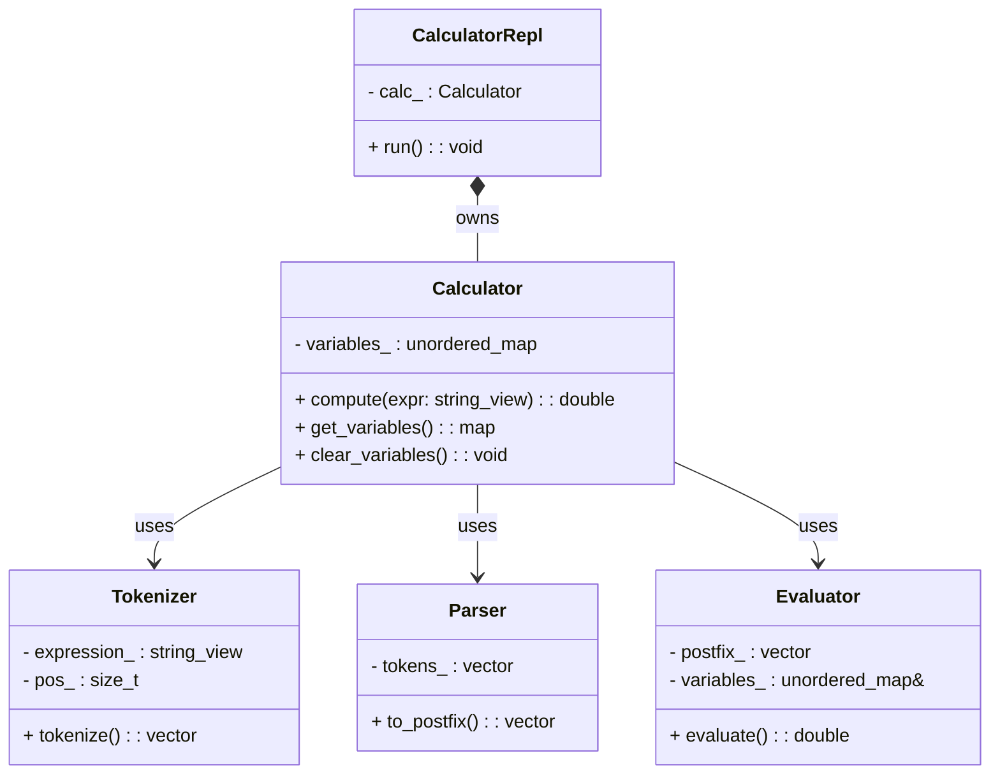

# 📐 類別結構圖（Mermaid）

```mermaid
classDiagram
  class Tokenizer {
    - expression_ : string_view
    - pos_ : size_t
    + tokenize() : vector<Token>
  }

  class Parser {
    - tokens_ : vector<Token>
    + to_postfix() : vector<Token>
  }

  class Evaluator {
    - postfix_ : vector<Token>
    - variables_ : unordered_map<string, double>&
    + evaluate() : double
  }

  class Calculator {
    - variables_ : unordered_map<string, double>
    + compute(expr: string_view) : double
    + get_variables() : map<string, double>
    + clear_variables() : void
  }

  class CalculatorRepl {
    - calc_ : Calculator
    + run() : void
  }

  %% 關係
  Calculator --> Tokenizer : uses
  Calculator --> Parser : uses
  Calculator --> Evaluator : uses
  CalculatorRepl *-- Calculator : owns
```
