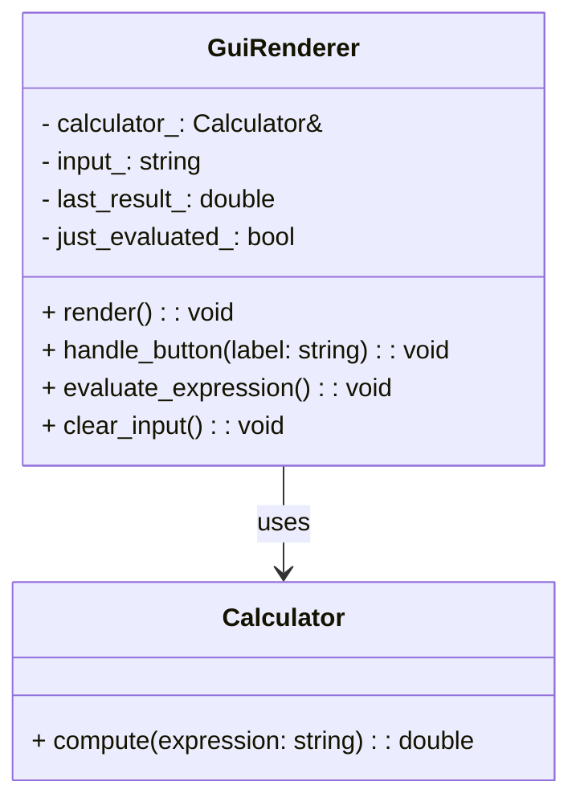

# 📐 類別圖：GuiRenderer + Calculator

```mermaid
classDiagram
  class GuiRenderer {
    - calculator_: Calculator&
    - input_: string
    - last_result_: double
    - just_evaluated_: bool
    + render(): void
    + handle_button(label: string): void
    + evaluate_expression(): void
    + clear_input(): void
  }

  class Calculator {
    + compute(expression: string): double
  }

  GuiRenderer --> Calculator : uses
```
