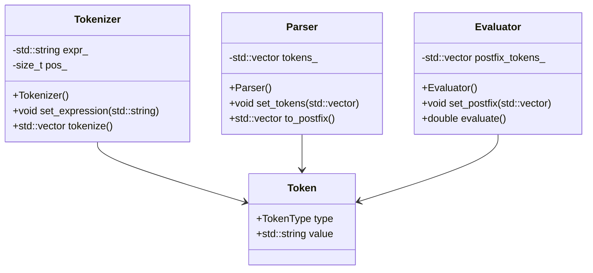

```mermaid
classDiagram
    class Token {
        +TokenType type
        +std::string value
    }

    class Tokenizer {
        -std::string expr_
        -size_t pos_
        +Tokenizer()
        +void set_expression(std::string)
        +std::vector<Token> tokenize()
    }

    class Parser {
        -std::vector<Token> tokens_
        +Parser()
        +void set_tokens(std::vector<Token>)
        +std::vector<Token> to_postfix()
    }

    class Evaluator {
        -std::vector<Token> postfix_tokens_
        +Evaluator()
        +void set_postfix(std::vector<Token>)
        +double evaluate()
    }

    %% 類別關係
    Tokenizer --> Token
    Parser --> Token
    Evaluator --> Token
```
